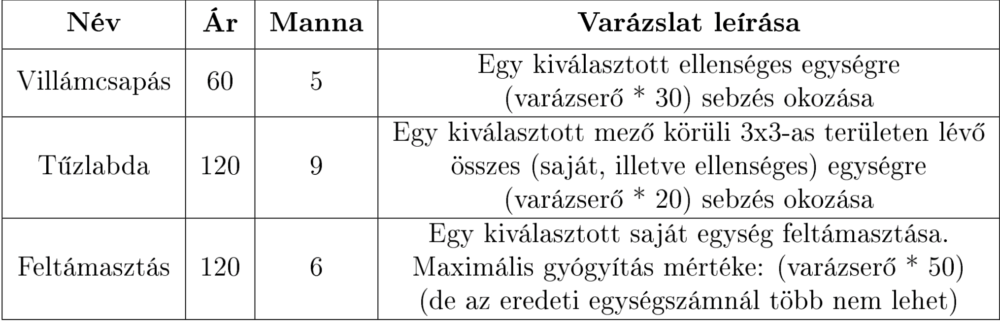

# Heroes of Might & Magic

author: Ambrus Attila

A Játék futtatása:

A játék futtatásához Java SE Development Kit 17 szükséges (Itt tudod letolteni: https://www.oracle.com/java/technologies/downloads/#java17 )

________________________________________________________________

## Játékmenet
### Előkészítés
3 nehézségi fokozat
- könnyű (1300 arany kezdésnek)
- közepes (1000 arany kezdésnek)
- nehéz (700 arany kezdésnek)

Az ellenfél mindig 1000 arannyal kezd.
### Játékmenet
Legalább 5 fajta egység

a másik kettőt nekem kell kitalálni

** Sebzés magyarázat: **
Adott típusú egységekből mindig legfeljebb egy lehet sérült, amelyiknek az életereje nem maximális. Tehát ha volt 100 íjászunk, akik kaptak 5 sebzést, akkor az összesített életerejük 695, ami azt jelenti, hogy 99 íjászunk van 7 életerővel és 1 íjászunk van 2 életerővel. Ha ezután kapnak az íjászok még 14 sebzést, akkor az összesített életerő 684 lesz. Ez azt jelenti, hogy 98 íjászunk marad, ebből 97 íjásznak lesz teljes életereje, míg 1 íjásznak lesz 5 életereje.

Bal oldalra játékos
Jobb oldalra a gép

A csatatér 12x10-es méretű (12 széles 10 magas)

Egységek elhelyezése a pályán, az első két oszlopban a felé eső térfelen.

Egy körben minden egység 1x lép.
A 

## Hősök
Tulajdonságok:

- Támadás ( sebzés +10% / pont )
- Védekezés ( ért sebzés -5% / pont )
- Varázserő ( varázserő növelése )
- Tudás ( +10 mana / pont)
- Morál ( + kezdeményezés / pont)
- Szerencse ( crit +5% / pont)

Default:
Mindenen 1 pont ( ez ingyenes )

Megkötés:
max 10 pont / tulajdonság

Első tulajdonság pont 5 arany, utána mindig 10%-al nő és mindig felfele kerekítődik. (5, 6, 7, 8, 9, 10, 11, 13)

A hős tud varázsolni, amihez varázslatra van szükség
* legalább 5 varázslat implementálása
Varázslatnak van:
- ára
- manaköltség
- hatás

a másik kettőt nekem kell kitalálni

## Leírás
User vs AI
Téglalap alakú pályán történik a harc.

## Beadási határidő: 2022.04.17. 23:59:00

## beadás:
- zip-ként csatolni minden működéshez szükséges forrás file-t
- max 20 MB
- relatív útvonalak használata
- ide kell beadni: https://moodle2.inf.u-szeged.hu/moodle38

## Követelmények:
- Java 17 
